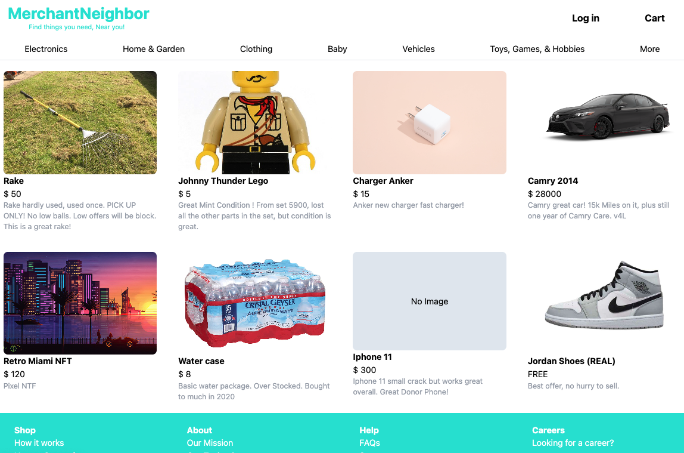
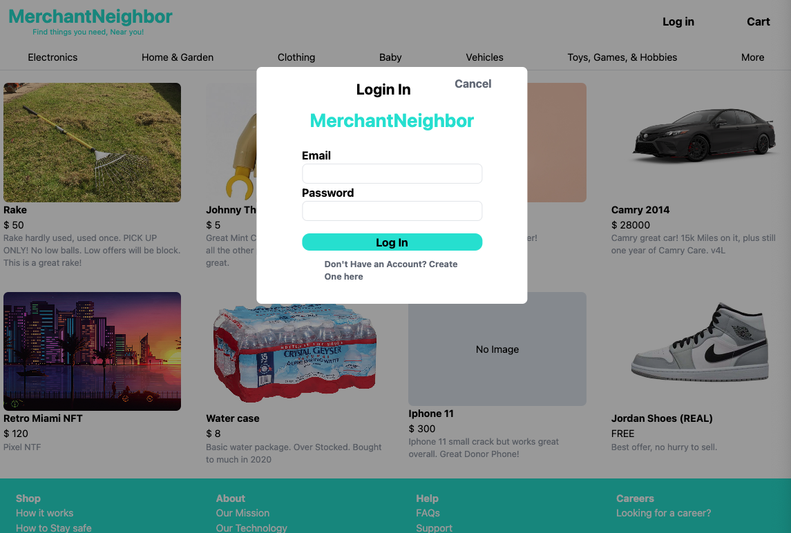
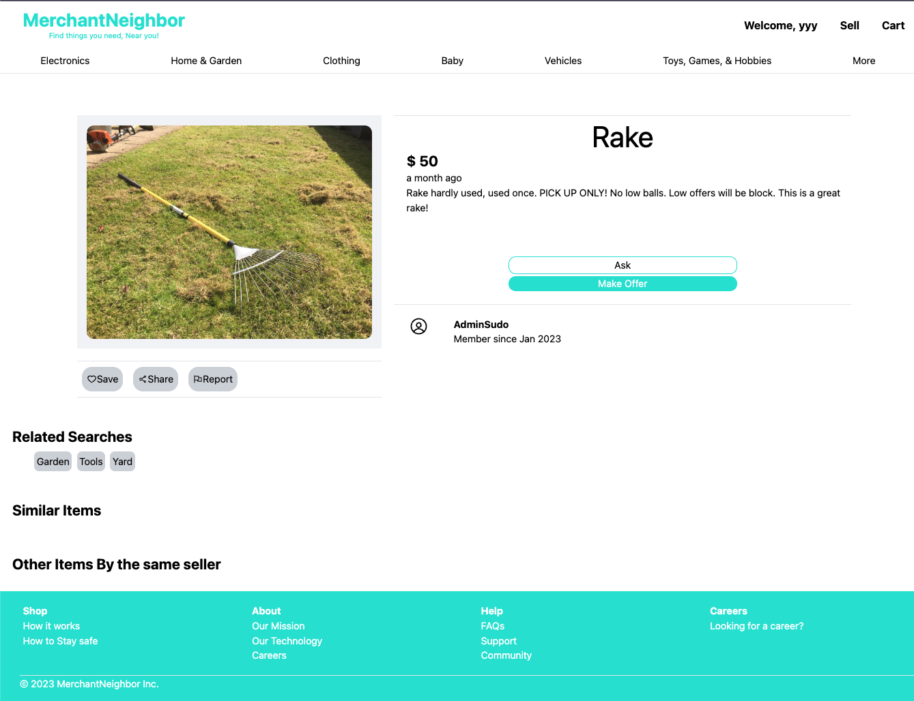

# Merchant Neighbor - Nextjs Django App

This will be an app where users can create an account and post items for sell. Other users can comment and send offers.

<h1>Current Render 2/10/23</h1>
 

<h3>Tech Stacked Used</h3>

- Python

  - django
  - cors
  - pillow

- Javascrip/Node

  - axios
  - number-format.js
  - moment.js

<h1>Dev blogs</h1>
-2/10/23

- Added Add Post for sell page and renders fine, also added related searches under each post

-1/30/23

- Added Auth to the login, able to login and set token to local storage. Loging in re-renders the header with a welcome to the logged in user by email.

-1/20/23

- Added a client side login/sign up popup

-1/18/23

- Server side - added user name field and date joined on post model
- Added user name and time joined on each post client side render

-1/15/23

- Added dynamic url get api to backend
- created client side dynamic url page rendering to pull data from backend

-1/14/23

Added image upload server func and pull to client
