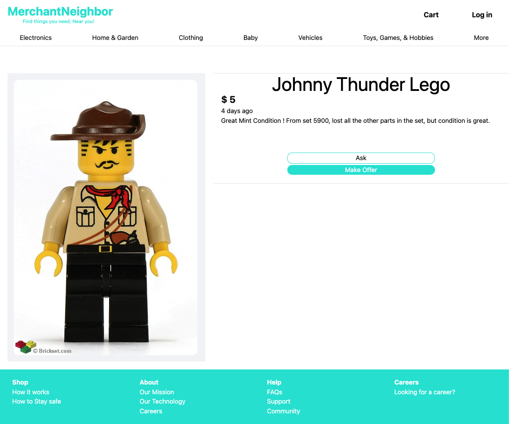

# Merchant Neighbor - Nextjs Django App

This will be an app where users can create an account and post items for sell. Other users can comment and send offers.

<h1>Current Render 1/16/23</h1>

|                            Index/Landing                            |                                                         Specific item |
| :-----------------------------------------------------------------: | --------------------------------------------------------------------: |
|  |  |

<h3>Tech Stacked Used</h3>

- Python

  - django
  - cors
  - pillow

- Javascrip/Node

  - axios
  - number-format.js

<h1>Dev blogs</h1>
-1/15/23

- Added dynamic url get api to backend
- created client side dynamic url page rendering to pull data from backend

-1/14/23

Added image upload server func and pull to client
